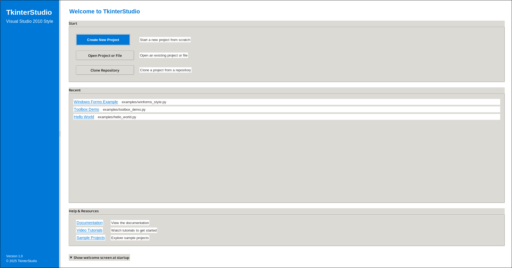
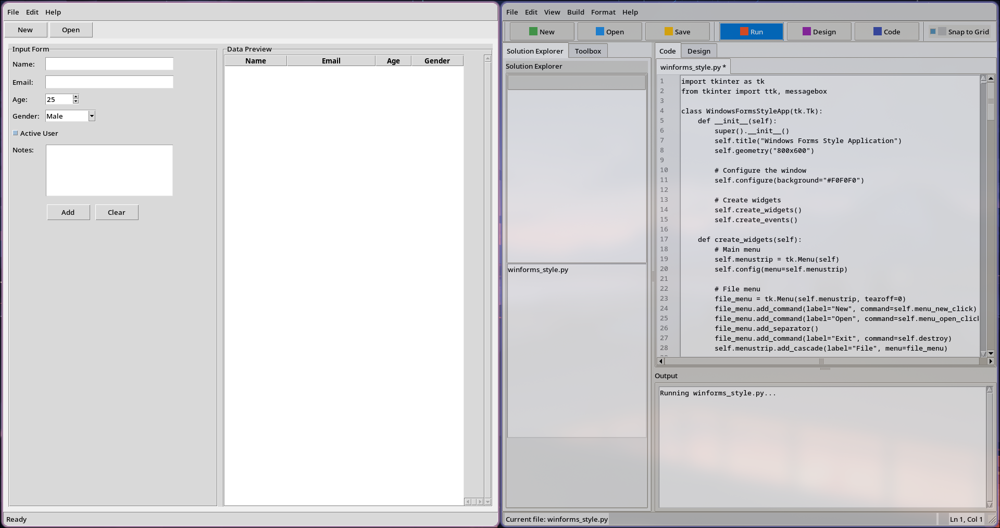

# TkinterStudio - Modern Visual Studio 2010 Windows Forms Style IDE

A sleek, responsive Python IDE built with Tkinter that faithfully reproduces the Visual Studio 2010 Windows Forms designer experience with a modern touch. Features include syntax highlighting, code execution, intuitive drag & drop functionality, and a responsive visual form designer with comprehensive toolbox for rapid GUI development.


*Screenshot: TkinterStudio with Modern Welcome Screen, Toolbox, Form Designer, and Code Editor*

## Features

- Modern Visual Studio 2010 Windows Forms designer-inspired interface
- Sleek welcome screen with quick access to recent projects
- Icon-rich toolbars and navigation for intuitive use
- Syntax highlighting for Python code with customizable editor
- Multi-tab editor for working with multiple files
- Solution Explorer with drag and drop capability
- File system drag and drop support with visual feedback
- Code execution with colorized output panel
- Full editing features (cut, copy, paste, undo, redo)
- Windows Forms-style Toolbox with categorized Tkinter widgets
- Responsive visual form designer with grid snapping and interactive resize handles
- VS2010-style Property Grid with categorized and alphabetical views
- Real-time code generation from visual designs
- Form alignment and sizing tools with tooltips
- User preference saving and loading

## Requirements

- Python 3.x
- Tkinter (included with most Python installations on Windows/macOS)
  - On Linux: `sudo apt-get install python3-tk` (Debian/Ubuntu)
  - On Linux: `sudo dnf install python3-tkinter` (Fedora)
  - On Linux: `sudo pacman -S tk` (Arch)
- Pillow: `pip install Pillow` (for image handling)
- Pyperclip: `pip install pyperclip` (for clipboard operations)

## Installation

1. Clone or download this repository
2. Install the required dependencies:
   ```
   pip install -r requirements.txt
   ```

## Usage

1. Run the application:
   ```
   python main.py
   ```

   Alternatively, use the launcher script:
   ```
   python start_ide.py
   ```

   The welcome screen will appear, allowing you to:
   - Create a new project
   - Open an existing project
   - Access recent projects
   - View documentation and tutorials

2. Interface Overview:
   - **Welcome Screen**: Quick start with recent projects and resources
   - **Menu Bar**: Access to all features and commands
   - **Toolbar**: Icon-rich quick access to common operations
   - **Solution Explorer**: View and manage project files
   - **Toolbox**: Searchable, categorized Tkinter widgets for drag-and-drop design
   - **Editor**: Write and edit Python code with syntax highlighting
   - **Form Designer**: Visually design Tkinter interfaces with real-time preview
   - **Properties Panel**: VS2010-style property grid to customize widget properties
   - **Output Panel**: Colorized execution results

3. Working with Files:
   - **New File**: Create a new file (Ctrl+N)
   - **Open File**: Open an existing file (Ctrl+O)
   - **Save**: Save the current file (Ctrl+S)
   - **Save As**: Save the current file with a new name (Ctrl+Shift+S)

4. Editing:
   - **Undo/Redo**: Ctrl+Z / Ctrl+Y
   - **Cut/Copy/Paste**: Ctrl+X / Ctrl+C / Ctrl+V

5. Running Code:
   - Press F5 or click the "Run" button in the toolbar
   - Output appears in the Output Panel at the bottom

6. Drag and Drop:
   - Drag files from your file explorer directly into the Solution Explorer
   - Rearrange files in the Solution Explorer by dragging them

7. Windows Forms Designer:
   - Switch between Code and Design views using F7/F8 or toolbar buttons
   - Drag widgets from the Toolbox onto the design surface with visual feedback
   - Use search box to quickly find widgets in the categorized Toolbox
   - Interactive resize handles for intuitive widget resizing
   - Snap-to-grid with visual guides for precise widget placement
   - Form resizing controls for quick form dimension adjustments
   - Select widgets to view/edit properties in the VS2010-style Property Grid
   - Switch between Categorized and Alphabetical property views with search filtering
   - Double-click on properties to edit them in a modern VS2010-style dialog
   - Use toolbar icons with tooltips for quick alignment and sizing operations
   - Real-time code generation that updates as you design

## Customization

You can customize the IDE by modifying the style settings in the `TkinterStudio.__init__` method:

```python
# Configure colors to match VS2010 with modern touches
self.style.configure('TFrame', background='#F0F0F0')
self.style.configure('TNotebook', background='#F0F0F0')
self.style.configure('TNotebook.Tab', background='#E3E3E5', padding=[10, 2])
self.style.configure('PropertyGrid.TFrame', background='#F5F5F5')
self.style.configure('Designer.TFrame', background='#FFFFFF')
self.style.configure('Toolbar.TFrame', background='#E6E6E6')
self.style.configure('Statusbar.TFrame', background='#CCCCCC')
self.style.configure('Modern.TButton', padding=4)
self.style.configure('Primary.TButton', background='#0078D7', foreground='white')
self.style.map('Primary.TButton', background=[('active', '#005A9E')])
```

Change these color codes to match your preferred color scheme.

You can also customize:
- Available widgets in the Toolbox by modifying the `tkinter_widgets` dictionary
- Default properties in the PropertyEditorFactory class
- Welcome screen appearance and content in the `welcome.py` module
- Icon set by adding more icons to the `icons.py` module

## Limitations

- The drag and drop functionality works best on Windows
- File system integration is basic and may not handle all edge cases
- Limited project management features compared to full IDEs
- Form designer does not support all layout managers (primarily uses place)
- Some Windows Forms widget equivalents are simulated with Tkinter widgets
- Property grid doesn't support all advanced property types found in VS2010
- The welcome screen recent projects are currently hardcoded examples

## Contributing

Feel free to fork this project and enhance it with additional features such as:

- Enhanced project management with templates
- Integrated debugging capabilities
- IntelliSense-style code completion
- Git integration with visual diff tools
- More robust drag and drop across platforms
- Support for more Windows Forms controls and events
- Enhanced property grid with type editors for all property types
- Support for custom controls in the toolbox
- Real recent projects tracking and management
- Theme customization with light/dark modes
- Support for additional layout managers (Grid, Pack)

## Screenshots



*Screenshot: Modern Welcome Screen with Recent Projects*


*Screenshot: Windows Forms-style Designer with Toolbox and Property Grid*


*Screenshot: Automatically Generated Code from Form Design*



*Screenshot: Windows Forms-style application created with the designer*
